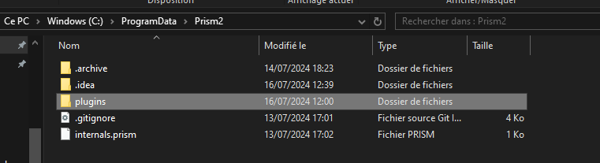
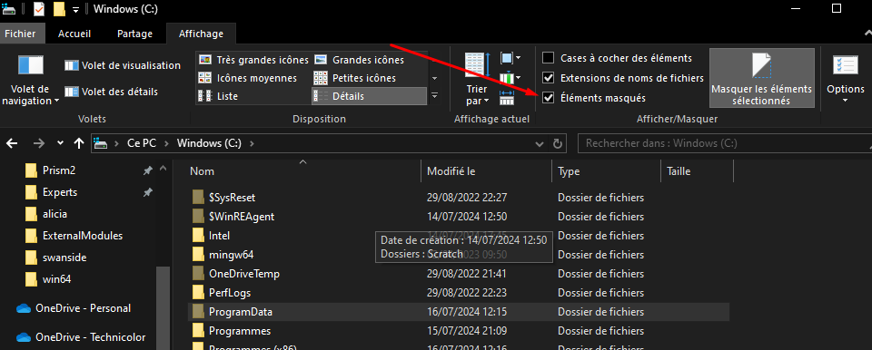
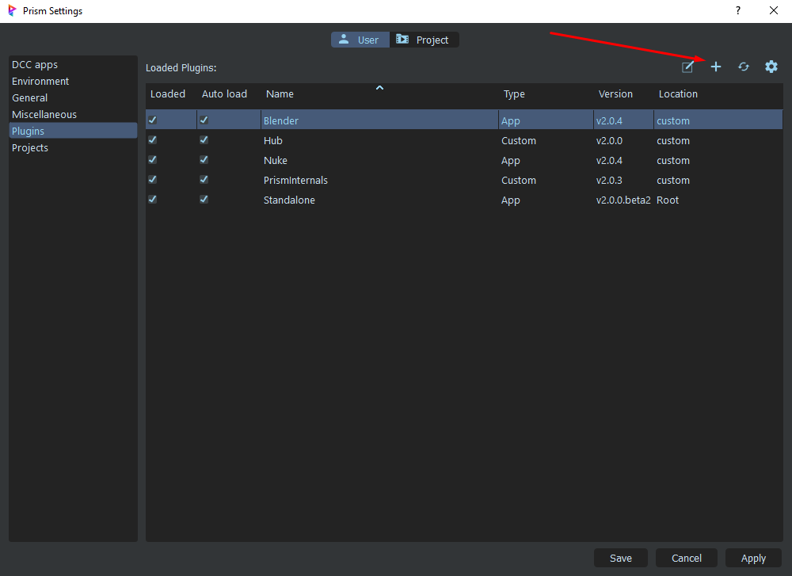
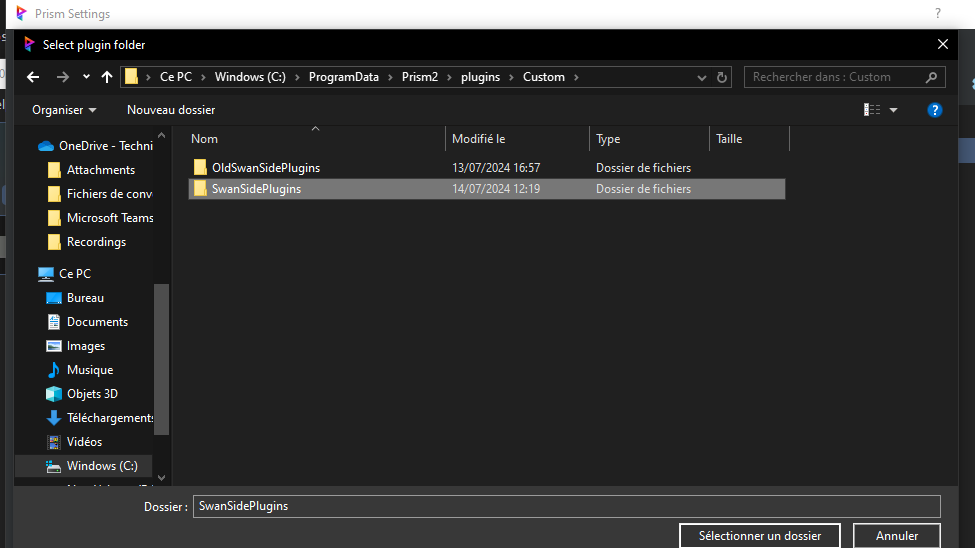
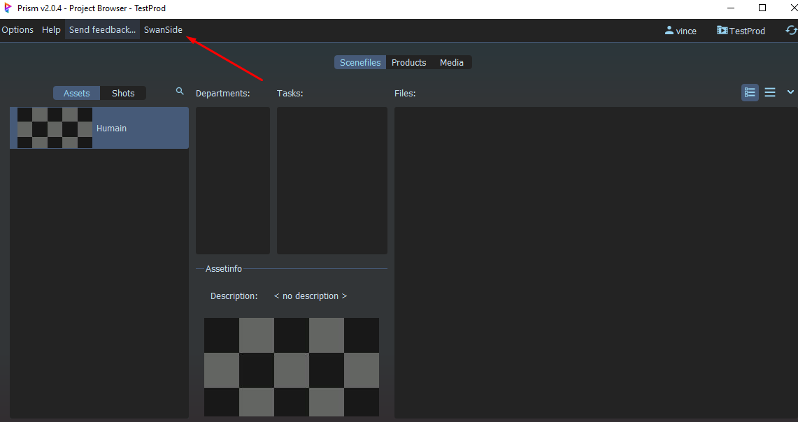

# Install SwanSide Scripts

## Téléchargement et dossier

Télécharger le scrit ici

Dézipez le .rar et copiez et remplacez le dossier plugins ici :

C:\ProgramData\Prism2

Si le dossier ProgramData n'est pas visible, vous pouvez cocher la case  "Elements masqués" dans Affichage.

## Dans Prism

### Loader le plugin SwanSide

Ouvrez Prism puis Options => Settings.. => dans la tab 'User' => Plugins

Loader le plugin SwanSidePlugins, qui se trouve dans le dossier **C:\ProgramData\Prism2\plugins \Custom**

"Apply" et "Save"

Si le plugin a bien été installé vous apercevrez  un menu "SwanSdie"

> Si vous rencontrez un problème à ce niveau, **contactez le [support](vincent.trolard@gmail.com)**

### Loader le plugin Apps (Cinema4D, After Effect)

Ouvrez Prism puis Options => Settings.. => dans la tab 'User' => Plugins
Loader les apps Cinema4D et After Effect qui se trouve dans **C:\ProgramData\Prism2\plugins \Apps**

