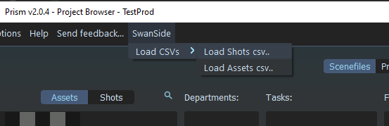
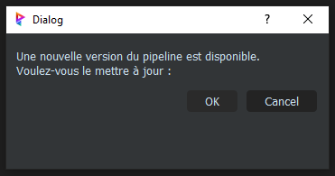

# SwanSidePlugins

## - Charger les CSVs

Le menu "SwanSide" avec son bouton "Load CSVs" simplifie le processus de création de dossiers pour les shots et les assets dans Prism. 
En suivant les étapes décrites dans cette documentation, vous pourrez facilement charger vos fichiers CSV et générer automatiquement les dossiers nécessaires pour votre projet.

Dans le menu de Prism => SwanSide => Load CSVs

Le bouton "Load CSVs" vous permet de charger deux fichiers CSV :
- Un fichier CSV pour la liste des shots.
- Un fichier CSV pour la liste des assets.

Une fois les fichiers CSV chargés, Prism va :

- Lire les données des CSV.
- Créer automatiquement des dossiers pour chaque shot et chaque asset listés dans les fichiers CSV respectifs.
- Placer ces dossiers dans la hiérarchie de projet appropriée.

## - Mise à jour / Revenir en arrière du version du pipe

### Mise à jour:

Lorsque une nouvelle version du pipeline est disponible, une fenêtre de notification apparaît pour vous informer et vous proposer de procéder ou non à la mise à jour.

Prism vérifie régulièrement si une nouvelle version du pipeline est disponible. Cette vérification se fait automatiquement au démarrage du programme et périodiquement pendant son utilisation.

### Rollback:

## - Nuke
### - Publish...
